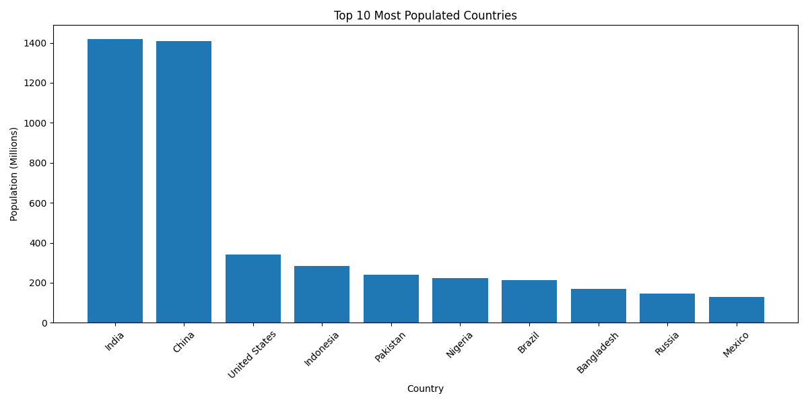

# 🌍 Countries API Dashboard

## 📌 Overview
**Python CLI project** that fetches data from the **REST Countries API**, processes it into a structured dataset, and visualizes insights with a clear dashboard.  

Demonstrates **Requests, JSON handling, Pandas, and Matplotlib** for API data analysis.

---

## ⚙️ Workflow

### 1️⃣ System Recognition
- **Domain:** API data retrieval and analysis.  
- **Goal:** Transform JSON from a public API into actionable insights.  
- **Constraint:** Handle nested JSON and ensure accurate aggregation.

### 2️⃣ Data Collection
- Connect to the REST Countries API.  
- Retrieve selected fields: `name`, `region`, `population`, `area`, `capital`.

### 3️⃣ Data Cleaning
- Convert nested JSON into a **structured pandas DataFrame**.  
- Sort and clean the data (remove missing or invalid entries).  
- Normalize population values (in millions).

### 4️⃣ Exploratory Analysis
- Identify Top 10 most populated countries.  
- Analyze trends across regions and population sizes.  

### 5️⃣ Visualization
- Generate **labeled bar charts** for top countries.  
- Preview dashboard in Python using Matplotlib.  



### 6️⃣ Insights / Output
- Structured dataset ready for further analysis.  
- Visual dashboard communicates key trends clearly.  

---

## 🚀 Key Features

| Feature | Technique / Concept |
|---------|-------------------|
| API data fetching | Requests to REST Countries API |
| JSON transformation | Nested JSON → pandas DataFrame |
| Data cleaning | Sort, normalize, remove invalid entries |
| Analysis | Top 10 countries by population |
| Visualization | Matplotlib bar chart dashboard |
| Automation | Single script from fetch → clean → visualize |

---

## 🛠️ How to Run

```bash
pip install requests pandas matplotlib
python api_data_dashboard.py
