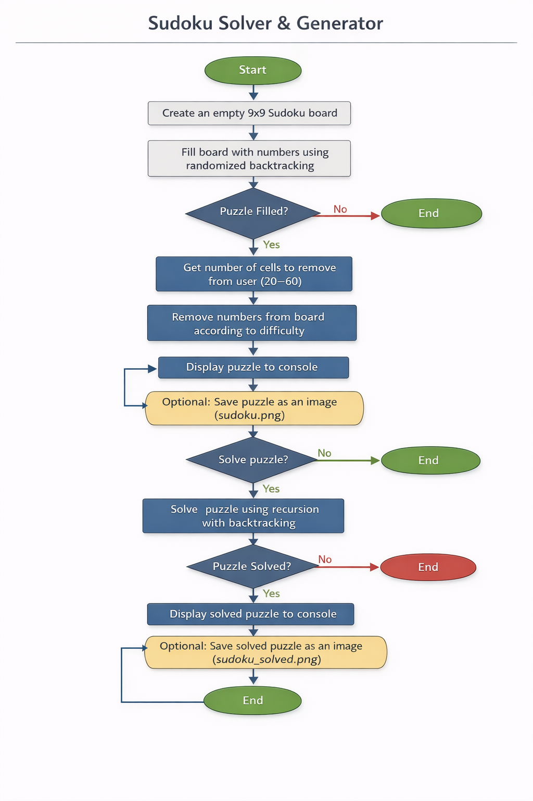

# 🧩 Sudoku Solver & Generator

## 📌 Overview
A **Python command-line Sudoku program** that can **generate puzzles** of varying difficulty and **solve them automatically**.  

Designed for **students, Python enthusiasts, and algorithm learners**, it demonstrates **backtracking, recursion, object-oriented thinking, and data visualization** while providing a fully functional puzzle solver and generator.

---

## ⚙️ Features

- Generate **valid 9x9 Sudoku puzzles**  
- Solve puzzles automatically using a **backtracking algorithm**  
- Adjustable **difficulty**: user chooses number of empty cells (20–60)  
- **Interactive CLI** for input and difficulty selection  
- **Visualize puzzles** as PNG images (`sudoku.png` and `sudoku_solved.png`)  
- Clean, modular, **readable Python code** suitable for learning and modification  

---

## 🛠️ How It Works

1. **Board Initialization**  
   - Create an empty 9x9 Sudoku board.

2. **Puzzle Generation (`fill_board`)**  
   - Fill the board completely using randomized backtracking.  
   - Remove numbers according to user-selected difficulty to generate a solvable puzzle.

3. **Puzzle Display (`print_board` & `show_board`)**  
   - Print puzzle to console in readable grid format.  
   - Optionally save the puzzle as a PNG image using matplotlib.

4. **Puzzle Solving (`solve`)**  
   - Use **recursive backtracking** to solve the puzzle.  
   - Display solved board in console and optionally as a PNG (`sudoku_solved.png`).

---

## 📊 Process Flow Diagram

A visual representation of the **Sudoku generation and solving workflow**:  

[](./images/sudoku_flow.png)  
*Shows steps: board creation → board filling → remove numbers → display → solve → save images.*

---

## 🚀 Usage

1. Run the script:  
```bash
python sudoku_solver_clean.py
